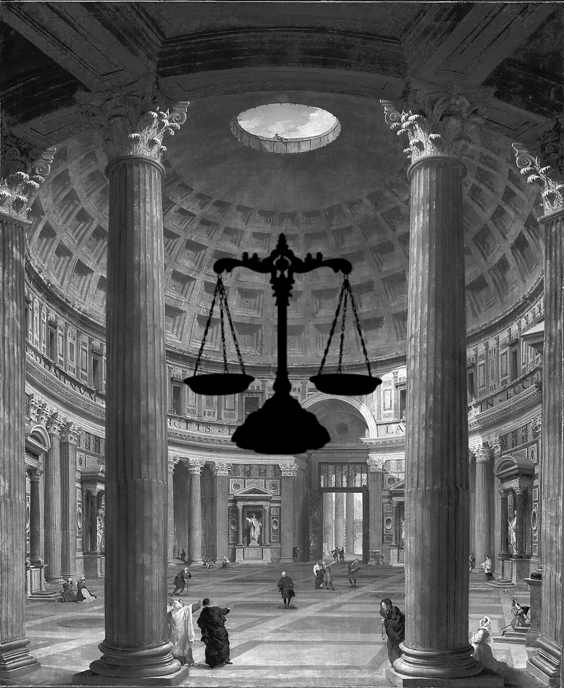
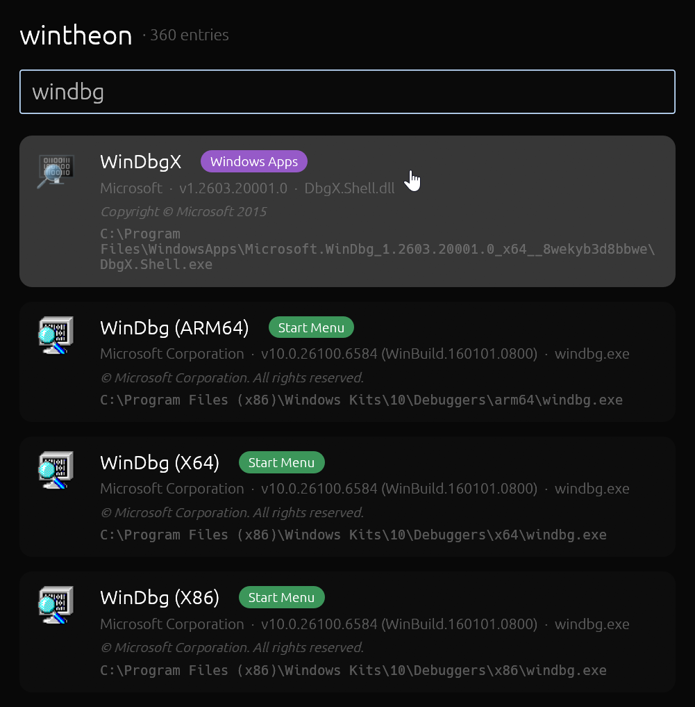

<table>
<tr></tr>
<tr>
<td width="35%">

</td>
<td>

# wintheon

**Library to discover, rank and inspect launchable Windows file entries.**

Walks multiple sources, such as **Desktop**, **Start Menu**, and the **Microsoft Store `WindowsApps`** folder — or any source you provide — yielding typed entries with resolved
target paths, shell icons, full file-version information metadata, and query-time relevance scoring.

[**crates.io**](https://crates.io/crates/wintheon) · [**docs.rs**](https://docs.rs/wintheon)

</td>
</tr>
</table>

<b>Example launcher</b> — Spotlight-style search bar built on the public API (<code>cargo run --example launcher</code>)

 

**Wintheon APIs used:** `Gatherer` with all three built-in sources at distinct priorities · `WeightedEntryIteratorExt::sorted_by_score` re-ranking every keystroke (per-entry `MatchIndex` cache) · `FileEntry::icon` + `FileIcon::extract_icon_at` for 64×64 RGBA · `FileEntry::version_info` for company / version / copyright badges · `FileEntry::link_path` for shell-correct launch targets.

**Layered on top:**

- Global `Shift+Alt+Space` hotkey via `global-hotkey`
- Frameless, always-on-top viewport
- Compact ↔ expanded resize on first keystroke (top edge stays put)
- Spotlight positioning anchored 120 px below screen top, horizontally centered
- ↑ / ↓ / Enter / Escape navigation, auto-focused search
- Color-coded origin chips, theme-aware card backgrounds
- On-disk RGBA cache under `%TEMP%` with mtime-header self-invalidation, mmap-backed reads (`mmap-io`)
- Background prewarm thread fills the cache at startup
- Lazy, visibility-gated texture upload at render time

